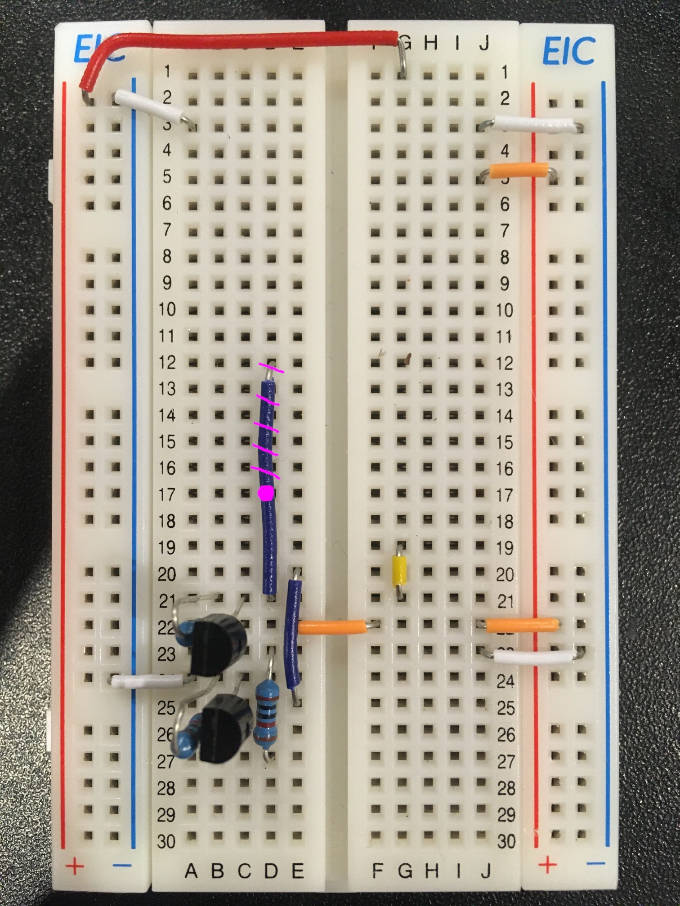
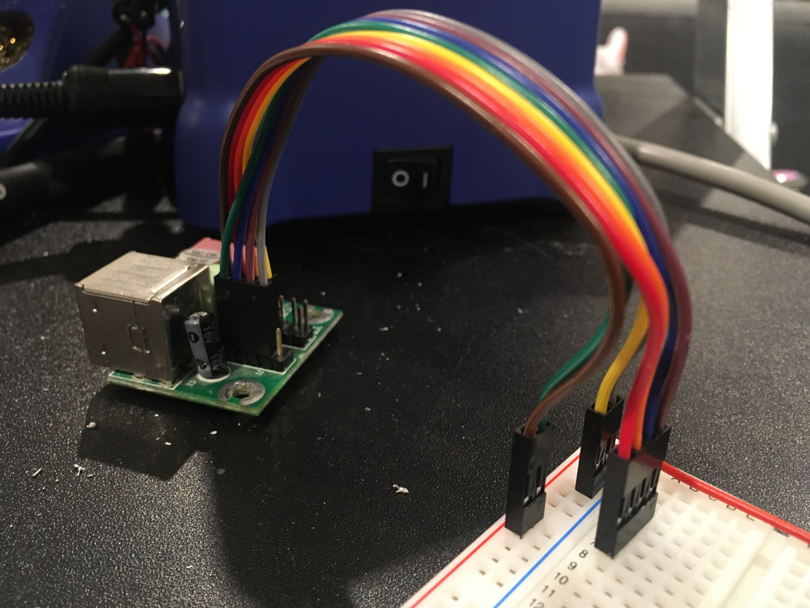
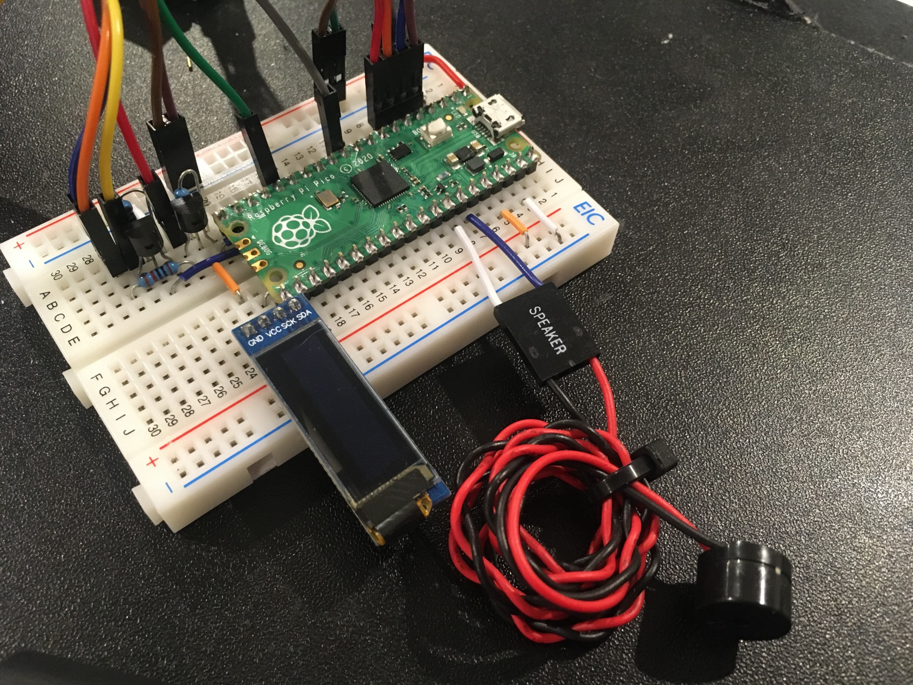

usb3sun
=======

usb3sun is a firmware for the RP2040 (Raspberry Pi Pico) that allows you to connect USB keyboards and mice to the Sun 8-pin mini-DIN interface.

see also:

* [USB2Sun](https://github.com/jgilje/USB2Sun) by @jgilje
* [sun2usb](https://github.com/jareklupinski/sun2usb) by @jareklupinski

instructions
------------

1. fix the -DCFG_TUSB_CONFIG_FILE in platformio.ini for your absolute path
2. apply [tinyusb1.patch](tinyusb1.patch) to <.pio/libdeps/pico/Adafruit TinyUSB Library/src/host/usbh.c> (version 1.16.0)
    * upstream patch: hathach/tinyusb#1786
3. apply [tinyusb2.patch](tinyusb2.patch) to <.pio/libdeps/pico/Adafruit TinyUSB Library/src/host/usbh.c> (version 1.16.0)

features
--------

* keyboard support
* mouse support
* power key support (experimental)
* LED indicators via SSD1306 (128x32)
* click and bell via passive piezo buzzer

bindings
--------

for more details, see [src/bindings.h](src/bindings.h), but here are the important ones:

| USB               | Sun                     |
|-------------------|-------------------------|
| context menu      | Compose                 |
| Left Alt          | Alt                     |
| Right Alt         | Graph/Alt               |
| Left GUI*         | left Meta (diamond)     |
| Right GUI*        | right Meta (diamond)    |
| Left Ctrl         | Control                 |
| Right Ctrl+Space  | (usb3sun settings menu) |
| Right Ctrl+Esc    | Front                   |
| Right Ctrl+Return | Line Feed               |
| Right Ctrl+F1     | Help                    |
| Right Ctrl+F4     | Props                   |
| Right Ctrl+=      | keypad =                |
| Right Ctrl+C      | Copy                    |
| Right Ctrl+F      | Find                    |
| Right Ctrl+O      | Front                   |
| Right Ctrl+P      | Power                   |
| Right Ctrl+V      | Paste                   |
| Right Ctrl+X      | Cut                     |
| Right Ctrl+Y      | Again                   |
| Right Ctrl+Z      | Undo                    |

\* aka Super, Mod4, Windows, etc

compatibility
-------------

- 04A5:8001 BenQ Zowie EC2 **mouse** — perfect
- 3367:1903 Endgame Gear XM1r **mouse** — buttons only (16-bit dx/dy, no boot protocol)
- 0461:4E24 HP KB71211 **keyboard** — almost perfect (lacks scroll lock or right meta)
- 0461:4E23 HP MOGIUO **mouse** — perfect
- 045E:0040 Microsoft Wheel **Mouse** Optical 1.1A — perfect
- 045E:0752 Microsoft Wired **Keyboard** 400 — perfect
- 045E:0750 Microsoft Wired **Keyboard** 600 — perfect

prototype assembly
------------------

### bill of materials

* 1x [raspberry pi pico, with headers](https://www.altronics.com.au/p/z6421a-raspberry-pi-pico-rp2040-development-board-with-headers/)
    * or 1x [raspberry pi pico](https://www.altronics.com.au/p/z6421-raspberry-pi-pico-microcontroller-board/) + 1x [0.1″ header pin block, 40x1](https://www.altronics.com.au/p/p5430-oupiin-40-way-header-pin/)
* 1x [ssd1306 i2c oled display, 128x32, with headers](https://www.aliexpress.com/item/1005004375650245.html)
* 2x [2n7000, n-channel mosfet, to-92 (s, g, d)](https://www.altronics.com.au/p/z1555-2n7000-to-92-n-channel-tmosfet/) ([datasheet](https://www.onsemi.com/pdf/datasheet/nds7002a-d.pdf))
* 3x 10K resistor, through hole
    * or 1x [10K resistor, through hole, 0W25 1%](https://www.altronics.com.au/p/r7582-10k-0.25w-metal-film-resistor-pk-10/)
    * or 1x [tinker component kit](https://www.altronics.com.au/p/k9640-tinker-parts-starter-kit/)
* 1x [solderless breadboard, 400 tie points (300+50+50)](https://www.altronics.com.au/p/p1002-400-way-breadboard/)
* 1x [solid wire kit, for solderless breadboards](https://www.altronics.com.au/p/p1018a-prototyping-breadboard-wire-packs-350pcs/)
    * or any sufficient amount of suitable solid wire
* 16x jumper wire, dupont 0.1″, pin to socket
    * or 1x [jumper wire, dupont 0.1″, pin to socket, row of 30](https://www.altronics.com.au/p/p1021-pin-to-socket-30-way-prototyping-ribbon-strips/)
* ⎰ 3x crimp housing, dupont 0.1″, 4x1
* ⎱ 4x crimp housing, dupont 0.1″, 2x1
    * or 1x [crimp kit, dupont 0.1″](https://www.altronics.com.au/p/k9642-2.54mm-header-kit-310pc/)
* ⎰ 1x piezo buzzer, passive
* ⎱ 1x usb breakout board, usb a, 2 ports
    * you can often find these in old computer cases

### reference designators

* Q1 = 2n7000 for keyboard rx level shifter
* Q2 = 2n7000 for keyboard tx level shifter (optional)
* Q3 = 2n7000 for mouse tx level shifter (optional)
* Q4 = 2n7000 for soft power key
* U1 = pico
* U2 = display

### assembly instructions

1. connect A3 (U1 GND) to the left (Vusb) negative rail
2. connect G1 (U1 VBUS) to the left (Vusb) positive rail
3. connect J3 (U1 GND) to the right (3V3) negative rail
4. connect J5 (U1 3V3(OUT)) to the right (3V3) positive rail
5. connect J23 (U2 GND) to the right (3V3) negative rail
6. connect J22 (U2 VCC) to the right (3V3) positive rail
7. connect E22 (Q1 pin 2) to F22 (3V3 supply)
8. connect A24 (Q4 pin 1) to the left (Vusb) negative rail
9. connect G21 (U2 SCK) to G19 (U1 GP17)
10. connect D21 (Q1 pin 1) to D12 (U1 GP9)
11. connect E25 (Q4 pin 2) to E20 (U1 GP15)
12. place Q1 pins (1,2,3) in (C21,C22,C23)
13. place Q4 pins (1,2,3) in (C24,C25,C26)
14. place resistor between B21 (Q1 pin 1) and B22 (3V3 supply)
15. place resistor between B23 (Q1 pin 3) and B27 (Vsun)
16. place resistor between B25 (Q4 pin 2) and B24 (ground)

17. [TODO]

